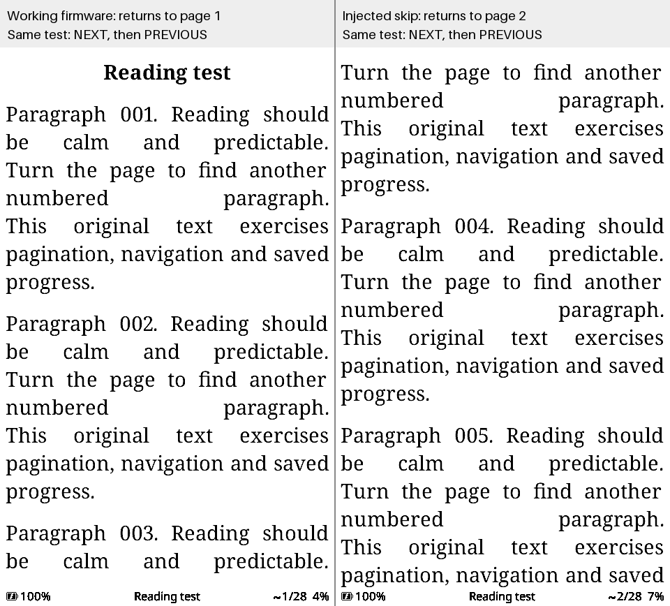

# What the unchanged #3379 smoke test detects

These are deliberately injected faults, **not historical bugs or proposed firmware changes**. They validate the narrow smoke test's ability to detect two reader regressions. The production contribution and its test are unchanged.

| Firmware | Build X3/X4 | Runtime X3/X4 | First failing assertion | Actions evidence |
| --- | --- | --- | --- | --- |
| Original PR head `59bda6bc` | Pass / Pass | Pass / Pass | None | [Baseline](https://github.com/marcusquinn/crosspoint-reader/actions/runs/34504516699) |
| Page-forward advances by two, `24ce277c` | Pass / Pass | Fail / Fail | `Round-trip navigation changed content: page-1 / page-1-back` | [Page-skip control](https://github.com/marcusquinn/crosspoint-reader/actions/runs/34504520013) |
| Saving reports success but skips the disk write, `cad733b6` | Pass / Pass | Fail / Fail | `Expected one persisted EPUB progress file` | [Lost-progress control](https://github.com/marcusquinn/crosspoint-reader/actions/runs/34504522539) |

## Visible failure: next then previous no longer returns to the original page

Both panels are unscaled X4 simulator captures after the same NEXT/PREVIOUS sequence. Only labels and a dividing line were added. This is not an e-ink photograph or an AI-generated illustration.

The lost-progress control still renders the pages and emits the original success logs. It passes the navigation and log-sequence checks, then fails on the missing **actual progress file**, rather than merely a missing log message.

## Reproducibility

- All runs use harness head `59bda6bc38fa074d2b2b3b2b03dd877c7fc5464d`, the unchanged `scripts/simulator_smoke.py`, native configuration and workflow from PR #3379.
- Each of the six device/control executions uses the identical generated EPUB SHA-256: `78fbeec2c40051d75a17ea8a6335e50482abeadd55aa8266d6d68e7cb7a4276c`.
- [Page-skip patch](https://github.com/marcusquinn/crosspoint-reader/commit/24ce277c697bc9326de67bb031ef30d53974209d): `EpubReaderActivity::pageTurn()` advances `currentPage` by two instead of one.
- [Lost-progress patch](https://github.com/marcusquinn/crosspoint-reader/commit/cad733b6b405e6d91c9bd8a3a061a867bfffe0c7): `EpubReaderUtils::saveProgress()` deliberately skips `ProgressFile::writeAtomic()` but retains its return value and success log.
- [Machine-readable records](results.json) include every exact firmware/harness SHA and original test result. The rendering script verifies the expected status, error, successful build and common fixture before generating this report.
- The image and JSON are committed here so the short review evidence survives Actions' 14-day artifact retention. Full logs/screenshots remain downloadable from those runs while retained.

## Boundaries

This demonstrates detection of skipped-page and lost-progress behaviour, not how often these bugs occur. It does not establish comprehensive rendering accuracy: consistently wrong typography can still pass within-run screenshot comparisons. It does not replace hardware testing for memory limits, timing, power, storage hardware or display waveforms. No physical-device testing is claimed.

No maintainer needs to flash a device or run the harness to inspect this demonstration. The control branches are evidence only and must not be merged or flashed.
